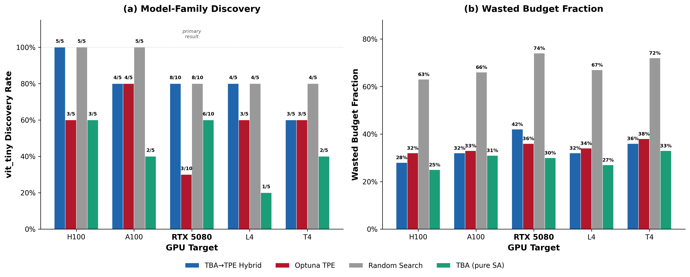

# Thermal Budget Annealing (TBA) + DeployBench

**Christian Lysenstøen** — UC Berkeley / INN (Inland Norway University of Applied Sciences)

**Crash-aware deployment optimization for ML models under hard constraints and tiny budgets.**

This repository contains two related research projects sharing the DeployBench infrastructure:

| Paper | Status | PDF |
|-------|--------|-----|
| **Feasible-First Exploration for Constrained ML Deployment Optimization** (TBA) | Awaiting arXiv endorsement | [PDF](paper/ConstrainedML_deployment_v2.pdf) |
| **Hidden Device Heterogeneity in INT8 Inference** | Ready for arXiv submission | [PDF](paper/lysenstoen2026_hidden_device_heterogeneity.pdf) |

---

## Paper 1: Thermal Budget Annealing (TBA)



Standard optimizers (TPE, Bayesian optimization, random search) waste 40–80% of their trial budget on configurations that crash, OOM, or violate deployment constraints. TBA-TPE Hybrid uses a two-phase strategy: Phase 1 runs crash-aware simulated annealing to map the feasible region in 5–15 trials, then Phase 2 warm-starts Optuna's TPE with all crash data so it optimizes within the safe region. On real ML deployment benchmarks (5 models × 3 backends × 3 quantization modes × 6 batch sizes), TBA-TPE finds the best feasible configuration in 25 trials while wasting 42% of budget, compared to TPE's 36% waste but lower accuracy (0.752 vs 0.761) because TPE gets stuck on suboptimal models it discovered early.

### Key Results

RTX 5080, edge_tight scenario (latency_p95 ≤ 20ms, memory ≤ 512MB), 10 seeds, 25 trials each:

| Metric | TBA-TPE Hybrid | Optuna TPE | Random Search | TBA (pure SA) |
|--------|---------------|------------|---------------|---------------|
| **Accuracy** | **0.761 ± 0.010** | 0.752 ± 0.010 | 0.762 ± 0.008 | 0.752 ± 0.019 |
| Waste % | 42% | 36% | 74% | 30% |
| **vit_tiny discovery** | **8/10** | 3/10 | **8/10** | 6/10 |


### How It Works

```
Phase 1: TBA Feasible-First SA (5-15 trials)
  - Adaptive simulated annealing explores the crash-heavy space
  - Finds feasible configs fast, maps crash zones
  - Hands off when 5+ feasible AND 3+ crashed/infeasible AND 3+ model families explored

Phase 2: Optuna TPE Warm-Started (remaining budget)
  - ALL Phase 1 history injected into Optuna study
  - TPE starts with a model trained on crash data
  - Optimizes within the feasible region
```

### Quick Start

```bash
pip install -e ".[gpu]"
```

Requires Python >= 3.10. GPU dependencies (torch, torchvision, onnxruntime) are in the `[gpu]` extra.

```python
from tba import optimize_deployment

best_config, result = optimize_deployment(
    data_dir="data/imagenette2-320",
    constraints={"latency_p95_ms": 20, "memory_peak_mb": 512},
    budget=25,
)
print(f"Best: {best_config['model_name']}, accuracy={result.objective_value:.3f}")
```

### Version History

#### v1 (March 2026)
- Core TBA optimizer with feasible-first SA exploration
- Adaptive temperature control, elite restart, decaying snap-back
- TPE warm-start handoff
- DeployBench benchmark suite
- Experiments on RTX 5080 (10 seeds)
- **Paper:** [v1 PDF](paper/ConstrainedML_deployment.pdf) — single-GPU results

#### v2 (April 2026)
- Trial timeouts: abort evaluations when latency > 5x constraint after warmup
- Subspace blacklisting: temporarily suppress categorical values after 3 consecutive failures
- Multi-GPU experiments: H100, A100, RTX 5080, L4, T4
- 31/31 tests passing
- **Paper:** [v2 PDF](paper/ConstrainedML_deployment_v2.pdf) — multi-GPU results, softened claims

#### v3 (April 2026)
- Diversity-gated handoff: Phase 1 must explore >=3 model families before handing off to TPE
- Adaptive timeout threshold: tightens from 5x to 3x after first feasible solution found
- Combination-level blacklisting: tracks 2-way categorical failure patterns instead of just individual values
- All existing tests passing + new v3 tests (46 total)

### Tested Platforms

| GPU | Environment | Notes |
|-----|-------------|-------|
| NVIDIA H100 | Google Colab | |
| NVIDIA A100 | Google Colab | |
| NVIDIA RTX 5080 | Windows, CUDA 12.8 | Primary development |
| NVIDIA L4 | Google Colab | |
| NVIDIA T4 | Google Colab | Cross-GPU validation |
| Apple M1 Max | macOS, CPU-only | 64 GB RAM |

---

## Paper 2: Hidden Device Heterogeneity

A follow-up empirical study showing that PyTorch's dynamic INT8 quantization (`torch.ao.quantization`) silently routes inference from GPU to CPU. This creates **stochastic feasibility boundaries**: identical configurations produce different latency distributions depending on which device actually executes them. GPU inference is deterministic; CPU inference under INT8 flips feasibility up to **39% of the time** for MobileNetV2.

This finding explains why deployment optimizers see non-reproducible results near constraint boundaries — the search space has a hidden device dimension that existing frameworks do not account for.

### Key Findings

#### GPU vs CPU Execution

| Metric | GPU configs (14 tested) | CPU/INT8 configs (6 tested) |
|--------|------------------------|-----------------------------|
| Max flip rate | 2% (noise-level) | **39%** |
| Configs with >10% flips | 0 | 2 |
| Execution device | Deterministic (CUDA) | Stochastic (CPU scheduler) |

#### Worst-Case Configuration

**MobileNetV2 / INT8 / batch size 3:**
- p95 latency: 19.70 ± 3.46 ms (threshold: 20 ms)
- Flip rate: **39%** — feasibility changes between runs
- Root cause: CPU thread scheduling variance under `torch.ao.quantization.quantize_dynamic`

#### Cross-GPU Comparison

- RTX 5080 → T4: **5.8× latency shift** for identical configurations
- Fixed safety margins (e.g., 15ms instead of 20ms): all statistically identical to baseline — margins cannot solve device heterogeneity

#### ACGF (Negative Result)

Adaptive Constraint Gradient Following was attempted as a learned alternative to fixed margins. It did not outperform the baseline. This negative result is documented in the paper and the code is preserved in `experiments/acgf/`.

---

## Repository Structure

```
tba/                              # TBA optimizer (Paper 1)
  api.py                          #   optimize_deployment() entry point
  types.py                        #   EvalResult, VariableDef dataclasses
  optimizer/
    tba_tpe_hybrid.py             #   TBA → TPE handoff optimizer
    tba_optimizer.py              #   Pure SA (ablation baseline)
    search_space.py               #   Hierarchical mixed-variable space
    subspace_tracker.py           #   Subspace + combo blacklisting
    surrogate.py                  #   RF surrogate (OOB-gated)
    feasible_tpe.py               #   KDE-based feasible-region sampler
    base.py                       #   BaseOptimizer ask/tell interface
  baselines/
    random_search.py              #   Random search baseline
    optuna_tpe.py                 #   Optuna TPE baseline
    constrained_bo.py             #   Constrained BO baseline (sklearn GP)
  benchmarks/
    profiler.py                   #   Deployment profiler (latency/memory/accuracy)
    model_zoo.py                  #   Pre-trained ImageNet models
    synthetic_bench.py            #   Crashy Branin + Hierarchical Rosenbrock
  spaces/
    image_classification.py       #   Search space definition + scenarios

experiments/
  boundary_probe/                 # Boundary probe experiment (Paper 2)
    select_boundary_configs.py    #   Config selector (zone-based)
    probe_runner.py               #   Subprocess-isolated probe runner
    analyze_boundary.py           #   Analyzer + figure generator
    boundary_configs.json         #   Selected configs (25 configs)
    flipper_configs.json          #   Follow-up flipper experiment configs
    int8_cross_model_configs.json #   Cross-model INT8 configs
  acgf/                           # ACGF method (negative result, Paper 2)
    acgf_evaluator.py             #   ACGF evaluator
    run_comparison.py             #   Comparison runner
    analyze_comparison.py         #   Comparison analyzer
  run_deployment.py               # TBA deployment experiment runner
  run_synthetic.py                # Synthetic benchmark runner
  run_budget_sweep.py             # Budget sweep experiment
  generate_figures.py             # TBA paper figure generator
  test_v2_features.py             # v2 feature tests
  test_v3_features.py             # v3 feature tests

results/
  boundary_probe/                 # Probe JSONL data (2,858 records)
    probe_*.jsonl                 #   Raw probe results (7 runs)
    summary_stats.json            #   Computed summary statistics
    figures/                      #   Generated figures (5 plots)
  acgf_comparison/                # ACGF comparison results

paper/                            # Paper PDFs
  ConstrainedML_deployment.pdf    #   TBA paper v1 (single-GPU)
  ConstrainedML_deployment_v2.pdf #   TBA paper v2 (multi-GPU)
  lysenstoen2026_hidden_device_heterogeneity.pdf  # Paper 2

data/imagenette2-320/             # ImageNette dataset (10-class ImageNet subset)
figures/                          # TBA paper figures
```

---

## DeployBench Configuration Space

| Dimension | Values |
|-----------|--------|
| Models | `resnet18`, `resnet50`, `mobilenet_v2`, `efficientnet_b0`, `vit_tiny` |
| Backends | `pytorch_eager`, `torch_compile`, `onnxruntime` |
| Quantization | `fp32`, `fp16`, `int8_dynamic` |
| Batch size | 1–32 (log scale) |
| num_threads | 1–8 (conditional on backend) |

**Constraint scenario (`edge_tight`):** p95 latency ≤ 20ms, peak memory ≤ 512MB

**Dataset:** ImageNette — a 10-class subset of ImageNet (Tench, English Springer, Cassette Player, Chain Saw, Church, French Horn, Garbage Truck, Gas Pump, Golf Ball, Parachute).

---

## Reproducing Results

### Paper 1: TBA Experiments

```bash
# Install
pip install -e ".[gpu]"

# Synthetic benchmarks (no GPU needed)
PYTHONPATH=. python experiments/run_synthetic.py --benchmark crashy_branin --budget 30 --seeds 10

# Budget sweep
PYTHONPATH=. python experiments/run_budget_sweep.py

# Real deployment (GPU + ImageNette required)
PYTHONPATH=. python experiments/run_deployment.py --scenarios edge_tight server_throughput --seeds 10

# Generate figures
PYTHONPATH=. python experiments/generate_figures.py
```

### Paper 2: Boundary Probe

```bash
# Additional dependency
pip install scipy psutil

# Step 1: Select boundary configs from existing TBA results
PYTHONPATH=. python experiments/boundary_probe/select_boundary_configs.py \
    --result-dirs results_deployment/edge_tight results_deployment_v2/edge_tight \
    --output experiments/boundary_probe/boundary_configs.json

# Step 2: Run the probe (50 repeats × 200 measurement passes per config)
PYTHONPATH=. python experiments/boundary_probe/probe_runner.py \
    --config-file experiments/boundary_probe/boundary_configs.json \
    --output-dir results/boundary_probe \
    --repeats 50 \
    --warmup-passes 20 \
    --measurement-passes 200 \
    --dataset-path data

# Step 3: Analyze results and generate figures
PYTHONPATH=. python experiments/boundary_probe/analyze_boundary.py \
    --input-dir results/boundary_probe \
    --output-dir results/boundary_probe/figures
```

### Paper 2: ACGF Comparison (Negative Result)

```bash
PYTHONPATH=. python experiments/acgf/run_comparison.py
PYTHONPATH=. python experiments/acgf/analyze_comparison.py
```

---

## Hardware

| Machine | GPU | OS | Python | Role |
|---------|-----|----|--------|------|
| Primary | NVIDIA RTX 5080 (Laptop) | Windows 11 | 3.14 | All experiments |
| Secondary | NVIDIA Tesla T4 | Linux (Colab) | 3.10 | Cross-GPU validation |

Additional GPUs tested for Paper 1: H100, A100, L4 (all Google Colab), Apple M1 Max (macOS, CPU-only).

---

## Citation

```bibtex
@article{lysenstoen2026tba,
  author  = {Christian Lysenstøen},
  title   = {Feasible-First Exploration for Constrained {ML} Deployment
             Optimization in Crash-Prone Hierarchical Search Spaces},
  year    = {2026},
  note    = {Awaiting arXiv endorsement},
  url     = {https://github.com/Chrislysen/Constrained-ML-Deployment}
}

@article{lysenstoen2026heterogeneity,
  author  = {Christian Lysenstøen},
  title   = {Hidden Device Heterogeneity: How Dynamic {INT8} Quantization
             Creates Stochastic Feasibility Boundaries in {ML} Deployment},
  year    = {2026},
  note    = {Submitted to arXiv},
  url     = {https://github.com/Chrislysen/Constrained-ML-Deployment}
}
```

---

## License

MIT — see [LICENSE](LICENSE).
